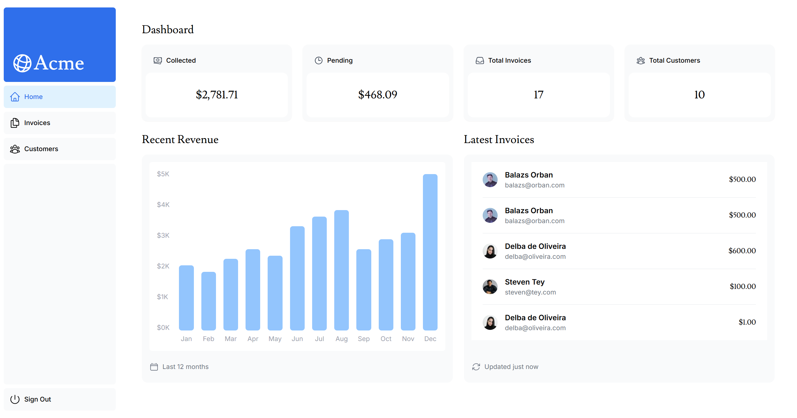
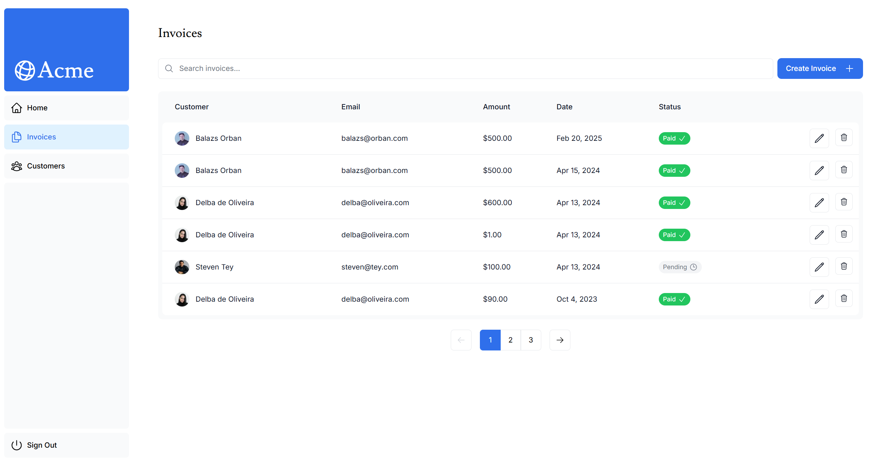
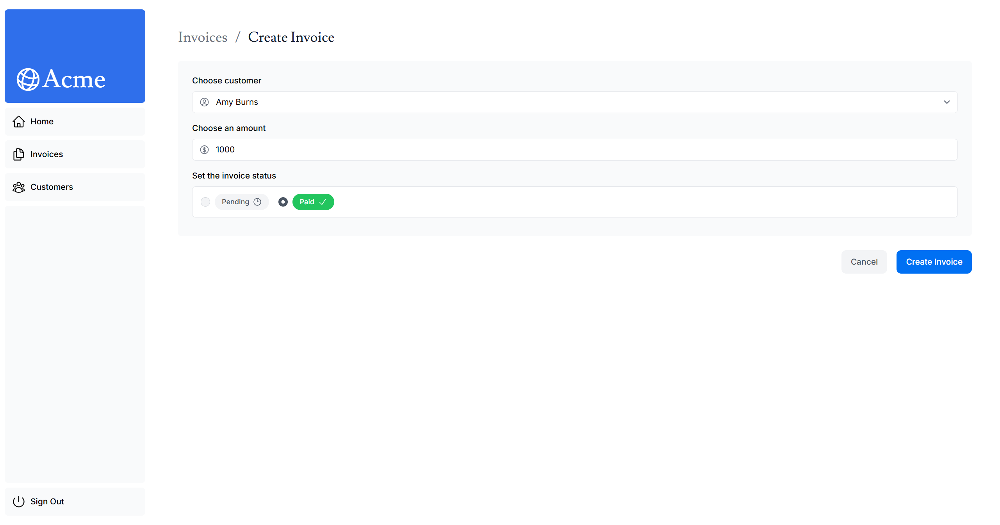

# Next.js Finance Dashboard Website
A Next. js-based website that can be used to create and track invoices. 

---

## Screens & Demo  
  
  
  

---

## Visiting the Website
You can visit the link  https://nextjs-finance-dashboard-website-sumukh-ps-projects.vercel.app/ to access the latest production build of the website.

---

## Features (What You’ll See)  
- Account creation and login 
- Dashboard with an invoice summary and a revenue bar chart
- Invoices for customers with an invoice creation feature

---

## Tech Stack  
- **Language**: Typescript, JavaScript, CSS
- **Frameworks**: Next.js, CSS Tailwind
- **IDE**: Visual Studio Code
- **Frontend**: Next.js
- **Backend**: Next.js Server Actions
- **Database**: PostgreSQL Neon Database

---

## Setup (Run in 2 Minutes)  
1. Clone the repository:  
   ```bash
   git clone https://github.com/SumukhP-dev/NextJs_Finance_Dashboard_Website.git
   ```
2. Run
   ```bash
   npm install
   ```
3. Run 
   ```bash
   next dev
   ```

---

## License & Contact  
**License:** MIT  

**Author:** Sumukh Paspuleti
- [LinkedIn](https://www.linkedin.com/in/sumukh-paspuleti/)  
- [Email](mailto:spaspuleti3@gatech.edu)  
